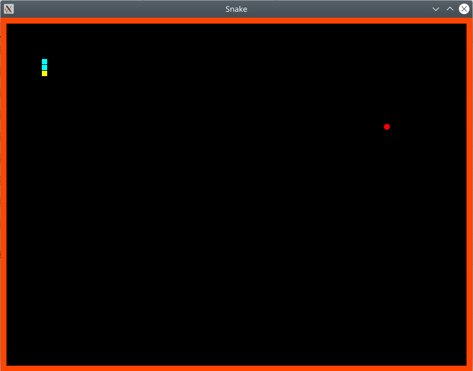

# snake
snake game made to start learning sfml

### playing the game : 
`[...]$git clone https://github.com/sutirtha8623/snake.git` 
`[...]$cd snake` 
`[... snake]$make` 
`[... snake]$./snake`

### screenshot:

